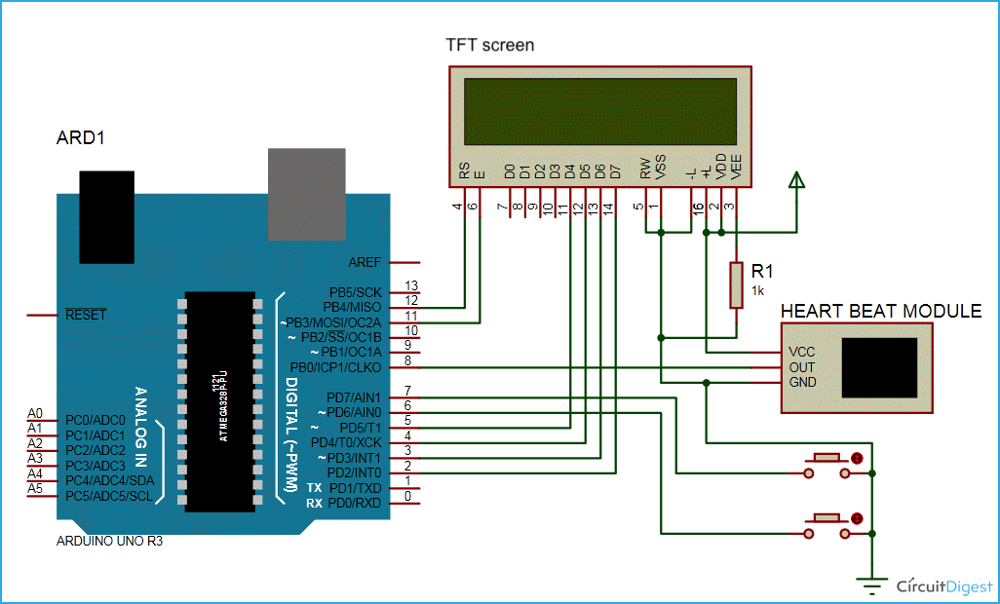
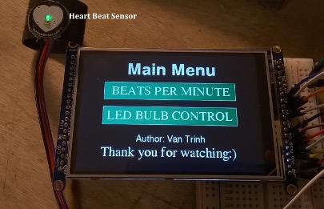
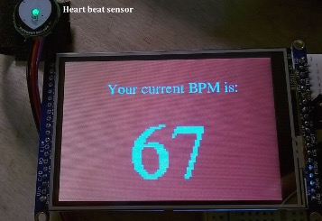

# HeartbeatMonitor

Arduino is a microcontroller platform able to read an input and produce an output. Arduino can be used to build low-cost scientific instruments and interactive prototypes. In this project, Arduino is used to build a heartbeat monitor. The parts for this instrument include: Arduino Uno R3 microcontroller board, 3.5” TFT screen, pulse sensor, and 9V power supply. 

Below is a schematic of the device. The heart rate sensor is connected to the Arduino microcontroller board, which controls the LCD screen and the LED bulb. Values from heart rate sensor and LED bulb can then be displayed on the LCD screen.

 
The initial display of the Arduino board is as follows:

 
Arduino continuously reads the heart rate sensor, and when user places finger on the sensor and taps on “Beats per minute” button, a screen appears and shows the beats per minute (BPM) heart rate. The code reads data from the analog pin, converts it into BPM data, and displays it on the screen. The value shown on the screen fluctuates as the BPM value is continuously updated. 

