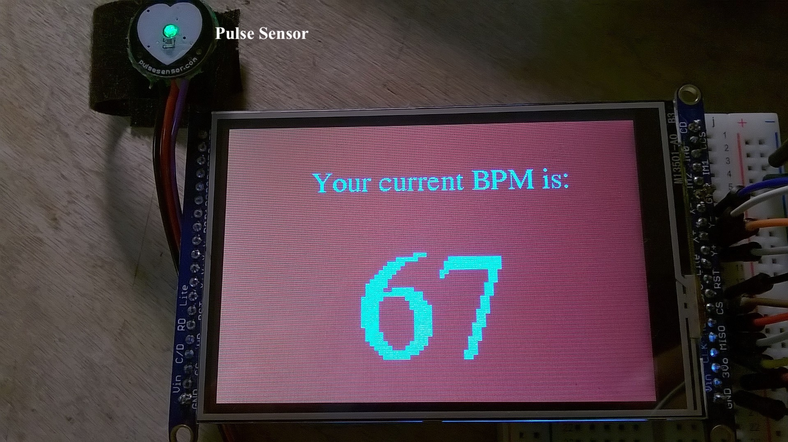

# HeartbeatMonitor

Arduino is a microcontroller platform able to read an input and produce an output. Arduino can be used to build low-cost scientific instruments and interactive prototypes. In this project, Arduino is used to build a heartbeat monitor. The parts for this instrument include: Arduino Uno R3 microcontroller board, 3.5” TFT screen, a pulse sensor, and a 9V power supply.  

Below is a schematic of the device. The pulse sensor is connected to the Arduino microcontroller board, which controls the TFT screen and the LED bulb. Values from pulse sensor and LED bulb can then be displayed on the TFT screen.

 
The initial display of the Arduino board is as follows:

 
Arduino continuously reads the heart rate sensor. When an user places a finger on the sensor and taps “Beats per minute” button on the screen, another screen appears and shows the beats per minute (BPM) heart rate. The code reads data from the analog pin, converts it into BPM data, and displays it on the screen. The value shown on the screen fluctuates as the BPM value is continuously updated. 

When user clicks on the “LED Bulb Control”, the LED control screen appears. User can control LED bulb from this screen by pressing on “ON” or “OFF” button. If either button is chosen, function `analogWrite()` is executed, and an analog value is written to the pin and changes the brightness of the LED bulb. When hitting “Back” button, the “Main Menu” screen appears.

## File Description
- [Calculate BPM](https://github.com/vantrinh7/HeartbeatMonitor/blob/master/src/Calculate%20BPM) performs Arduino timer interrupt function, reads the pulse sensor, and calculates BPM values.
- [Handle Screen Events](https://github.com/vantrinh7/HeartbeatMonitor/blob/master/src/Handle%20screen%20events) handles touch screen interactions, draws the touch screen objects, and controls the LED bulb.

 
